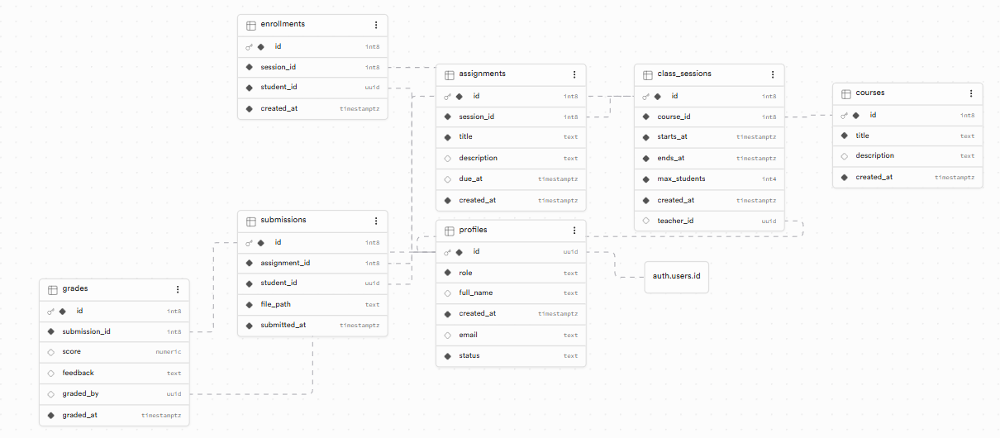
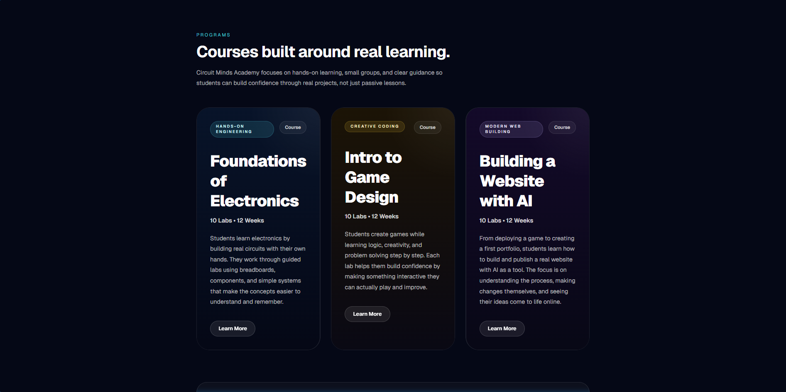
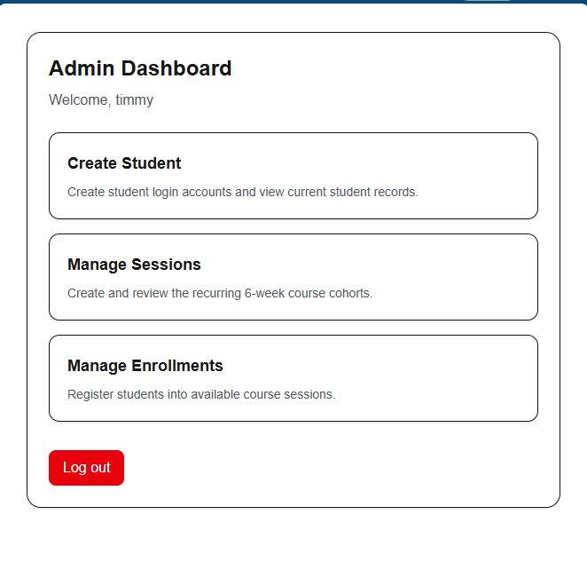
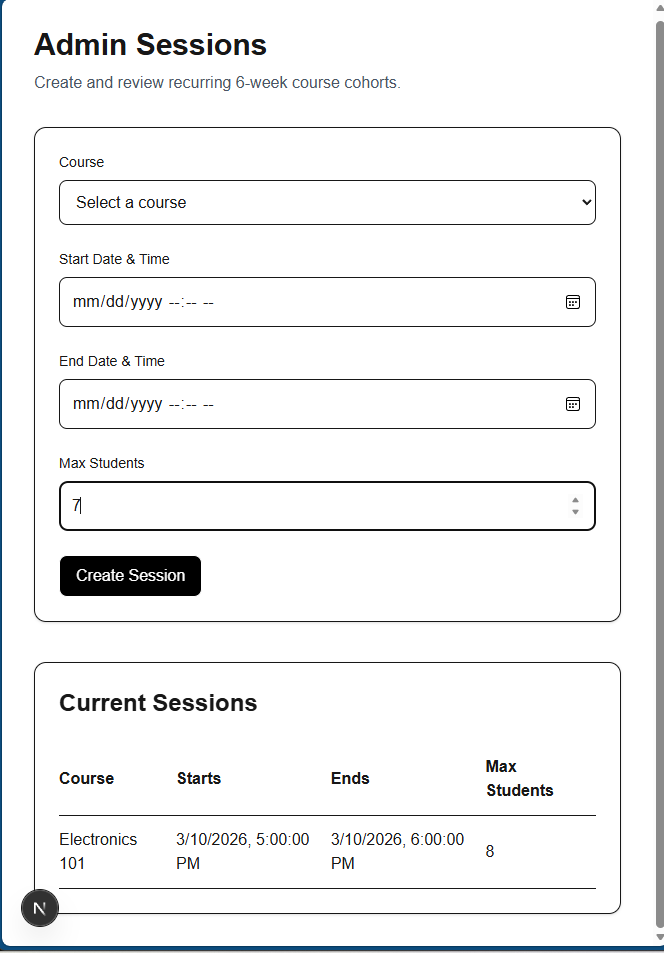
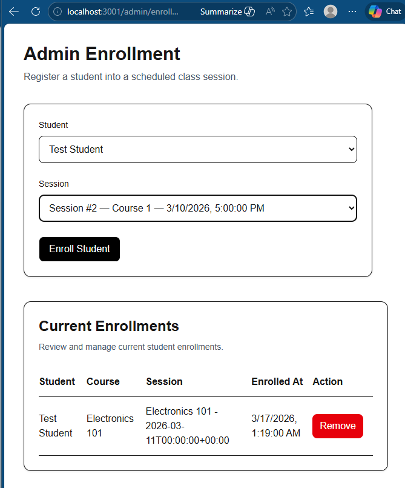

# Circuit Minds

Circuit Minds is a full-stack STEM education platform built as a monorepo. It includes a public marketing website, an authenticated portal for students and admins, and a backend API for protected business logic such as student creation, session management, and enrollments.

## Live Links

- Public Website: https://circuit-minds-web.vercel.app/
- Portal App: https://circuit-minds-app.vercel.app/
- Repository: https://github.com/davidmtzh/circuit-minds

## Overview

Circuit Minds was designed around a real course workflow for recurring electronics and robotics programs.

The platform currently supports:

- secure login with Supabase Auth
- role-based redirects for admin, teacher, and student users
- admin creation of student accounts
- admin creation of course sessions
- admin management of enrollments
- student dashboard with enrolled class information
- protected backend endpoints for admin-only actions

## Monorepo Structure

```text
apps/
  web/   -> Public marketing website
  app/   -> Authenticated student/admin portal
  api/   -> NestJS backend API
docs/    -> Deployment and project notes
```

## Frontend

Next.js
React
TypeScript
Tailwind CSS

## Backend

NestJS
TypeScript
Auth and Database
Supabase Auth
Supabase Postgres

### Database Schema
Core relational schema used to model users, courses, sessions, enrollments, and coursework workflows.


## Deployment

Vercel for frontend apps
Backend prepared for external hosting such as Railway or a VM
Environment-based configuration for frontend and backend separation

## Security

Supabase authentication for login
protected routes in the portal
backend admin authorization checks
service role key kept backend-only
environment separation between public and privileged services

## Screenshots

### Homepage


### Admin Dashboard


### Admin Sessions


### Admin Enrollments


